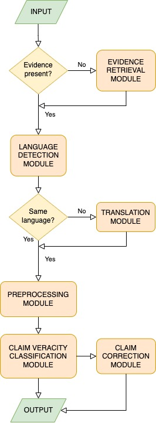

# Enterprise Data Verification: An LLMs Fact-Checking Solution

In our work, we propose a multi-module architecture for automatic fact-checking that can be seen in the figure below. Our system consists of different modules that can be used according to the user’s needs. In the following chapter, we will go through different parts of our architecture in detail and present the workings of each module.

1. Input - Input format can vary based on the user’s needs. Our system generally accepts two separate string inputs: the claim we want to fact-check and the evidence to support this claim. But if evidence is not provided we can utilise our Evidence retrieval module.

2. Evidence retrieval module - If the evidence is not provided by the user it is obtained from other sources. Our system uses the first top N search results obtained from the selected public search engine (Google, Bing, etc.). In the next step, we obtain the text from the selected websites and parse them into smaller chunks of text. From these chunks, we can create vectors (embeddings) that can be used for obtaining the most relevant chunks based on our claim. To create the embeddings, we would use the open-source model described in [1] based on the BERT model. Once the embeddings are created we create an embedding out of the provided claim and use it to find the most similar chunks in each of the provided articles. For the similarity score, we would use cosine distance. Our evidence would then consist of the top N most relevant chunks based on the given claim.

3. Language detection module - In the next step, our input is processed by the Language detection module. For our claim veracity classification models to work it is important that both the claim and the evidence are written in the same language, for better contextual understanding. Based on the result of the Language detection module we would utilize the Translation module in the next step. For the language detection model, we would use the FastText model described in [2], developed by Meta.

4. Translation module - The Translation module ensures that the evidence and the provided claim are written in the same language before being fed to our veracity classification models. For the translation model, we would use the state-of-the-art model described in [3], developed by Meta.

5. Preprocessing module - The Preprocessing module takes care of data cleaning and preprocessing based on the selected model used in the Claim veracity classification module.

6. Claim veracity classification module - The Claim veracity classification module is used to determine the truthfulness of the provided claim against the provided or obtained evidence. For the actual classification, we would use three different methods and choose the best one that would be suitable for our system based on their performance evaluation. We chose three state-of-the-art models. Two of them are specially designed for the task of fact-checking (LOREN [4] and MultiVerS [5]) and the third one is an LLM with general tasking capabilities that can be utilized by designing the correct instructions (Llama 2 [6]).

7. Claim correction module - If our Claim veracity classification module detects that the provided claim is not truthful based on the provided evidence the Claim correction module tries to correct the invalid part of the claim. For this model, we would again use Llama 2 with its general conversational abilities. With carefully crafted instructions (prompt) and the false claim and given evidence as the model’s input the output of the model would be a corrected claim.

8. Output - The output of the system cannot be binary (true/false) because the veracity of the claim might not be fully aligned with one of two possible outputs. The provided claim might be partly false or truthful, so our system should use multinomial classification (e.g. true, mostly true, false, and not enough information).

Implemented system will be open-sourced and easy to use by providing its Docker images and detailed documentation.

## A multi-module architecture for automatic fact-checking:

  

## References:

[1] Reimers, Nils, and Iryna Gurevych. "Sentence-BERT: Sentence Embeddings Using Siamese BERT-Networks." arXiv preprint arXiv:1908.10084 (2019).

[2] Bojanowski, Piotr, et al. "Enriching Word Vectors with Subword Information." Transactions of the Association for Computational Linguistics 5 (2017): 135-146.

[3] Barrault, Loïc, et al. "SeamlessM4T-Massively Multilingual & Multimodal Machine Translation." arXiv preprint arXiv:2308.11596 (2023).

[4] Chen, Jiangjie, et al. "LOREN: Logic-Regularized Reasoning for Interpretable Fact Verification" Proceedings of the AAAI Conference on Artificial Intelligence. Vol. 36. No. 10. 2022.

[5] Wadden, David, et al. "MultiVerS: Improving scientific claim verification with weak supervision and full-document context." arXiv preprint arXiv:2112.01640 (2021).

[6] Touvron, Hugo, et al. "Llama 2: Open foundation and fine-tuned chat models." arXiv preprint arXiv:2307.09288 (2023).
